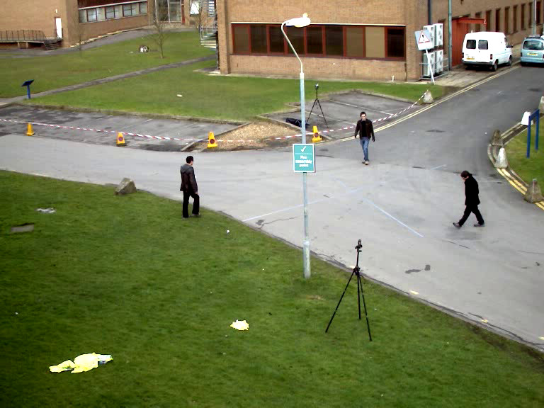

# OpenCV_Select_Non_Rect_ROI

This is sample code that show how select non rectangular ROI 

You can select four point on the first frame of video and then press twice any key except 'C' or 'c' 
As you select four points, minimum rect that contain your ROI begin to show

  

  

With pressing 'C'(or 'c') you can clean the points and select them again

**Notice: First select _top-left_ point!**
